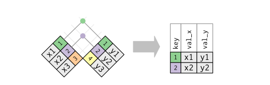
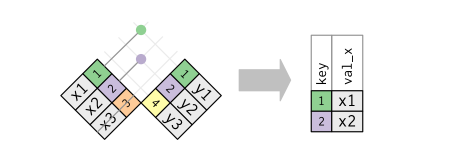
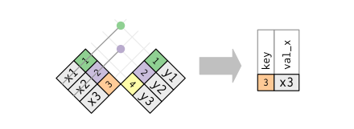
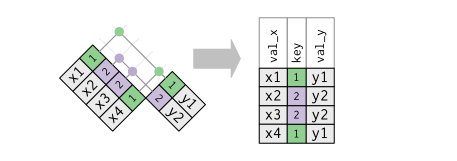
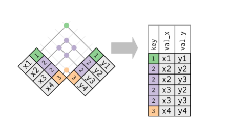
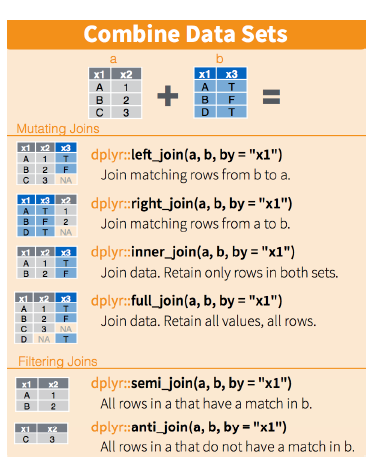

dplyr table joins
================
DanielH
April 16, 2019

-   [keys](#keys)
-   [mutating joins](#mutating-joins)
-   [filtering joins](#filtering-joins)

``` r
library(tidyverse)
library(nycflights13)
library(dslabs)
```

------------------------------------------------------------------------

For the following examples we use data from the `dslabs` package, more specifically we use the `murders` and the `results_us_election_2016` datasets. Both datasets have 51 obs (rows). For semplicity, we then use subsets of those datasets

We will also use flights data from the nycflights13 package

``` r
murders <-
  murders  %>%
  as_tibble()

# subset
tab1 <-
  murders %>%
  slice(1:6) %>%
  select(state, population)
  


results_us_election_2016 <-
  results_us_election_2016 %>%
  as_tibble()

# subset
tab2 <-
  results_us_election_2016 %>%
  filter(state %in% c("Alabama", "Alaska", "Arizona", 
                      "California", "Connecticut", "Delaware")) %>%
  select(state, electoral_votes)
```

------------------------------------------------------------------------

### keys

> The variables used to connect each pair of tables are called keys. A key is a variable (or set of variables) that uniquely identifies an observation

In simple cases, a single variable is sufficient to identify an observation. In other cases, multiple variables may be needed.

There are two types of keys

-   A **primary key** uniquely identifies an observation in its own table.

-   A **foreign key** uniquely identifies an observation in another table.

A variable can be both a primary key and a foreign key.

Once we’ve identified the primary keys in your tables, it’s good practice to verify that they do indeed uniquely identify each observation. One way to do that is to `count()` the primary keys and look for entries where n is greater than one:

``` r
planes %>%
  count(tailnum) %>%
  filter(n > 1)
```

    ## # A tibble: 0 x 2
    ## # ... with 2 variables: tailnum <chr>, n <int>

As a second example we now check keys for the weather table

``` r
weather %>%
  count(year, month, day, hour, origin) %>%
  filter(n > 1)
```

    ## # A tibble: 3 x 6
    ##    year month   day  hour origin     n
    ##   <dbl> <dbl> <int> <int> <chr>  <int>
    ## 1  2013    11     3     1 EWR        2
    ## 2  2013    11     3     1 JFK        2
    ## 3  2013    11     3     1 LGA        2

In this case the keys don't uniquely identify each observation in the table

Sometimes a table doesn’t have an explicit primary key: each row is an observation, but no combination of variables reliably identifies it.

mutating joins
--------------

> A mutating join allows you to combine variables from two tables. It first matches observations by their keys, then copies across variables from one table to the other.

Like `dplyr::mutate()`, the join functions add variables to the right

### inner join

> Return all rows from x where there are matching values in y, and all columns from x and y. If there are multiple matches between x and y, all combination of the matches are returned

We use this join when we want to keep only the rows that have information in both tables



**The most important property of an inner join is that unmatched rows are not included in the result**

so, if we want to keep only the rows that have information in both tables, we use `inner_join`

``` r
tab1 %>%
  inner_join(tab2, by = "state")
```

    ## # A tibble: 4 x 3
    ##   state      population electoral_votes
    ##   <chr>           <dbl>           <int>
    ## 1 Alabama       4779736               9
    ## 2 Alaska         710231               3
    ## 3 Arizona       6392017              11
    ## 4 California   37253956              55

### outer joins

> An outer join keeps observations that appear in at least one of the tables. There are three types of outer joins


**The most commonly used join is the left join: we use it whenever we look up additional data from another table, because it preserves the original observations even when there isn’t a match.**

### left-join

> Return all rows from x, and all columns from x and y. If there are multiple matches between x and y, all combination of the matches are returned.

Suppose we want to explore the relationship between population size for US states and electoral votes. We have the population size in one table and the electoral college in the other. We need a new table with the combined information, we need left\_join in this case

``` r
merged_tab <-
  tab1 %>%
  left_join(tab2)
```

    ## Joining, by = "state"

``` r
merged_tab
```

    ## # A tibble: 6 x 3
    ##   state      population electoral_votes
    ##   <chr>           <dbl>           <int>
    ## 1 Alabama       4779736               9
    ## 2 Alaska         710231               3
    ## 3 Arizona       6392017              11
    ## 4 Arkansas      2915918              NA
    ## 5 California   37253956              55
    ## 6 Colorado      5029196              NA

Now we have a single table with both the required vars in it. Note that NAs are added to the two states not appearing in tab\_2.

### right-join

> A right join returns all rows from the right table (y), and the matched records from the left table

If instead of a table with the same rows as first table, we want one with the same rows as second table, we can use this type of join

``` r
tab1 %>%
  right_join(tab2)
```

    ## Joining, by = "state"

    ## # A tibble: 6 x 3
    ##   state       population electoral_votes
    ##   <chr>            <dbl>           <int>
    ## 1 California    37253956              55
    ## 2 Arizona        6392017              11
    ## 3 Alabama        4779736               9
    ## 4 Connecticut         NA               7
    ## 5 Alaska          710231               3
    ## 6 Delaware            NA               3

Now the NAs are in the column coming from `tab_1`.

filtering joins
---------------

> Filtering joins match observations in the same way as mutating joins, but affect the observations, not the variables.

Only the existence of a match is important; it doesn’t matter which observation is matched. This means that filtering joins never duplicate rows like mutating joins do:

There are two types:

1.  `semi_join(x, y)` **keeps** all observations in x that have a match in y

2.  `anti_join(x, y)` **drops** all observations in x that have a match in y

### semi join

> Semi join return all rows from x where there are matching values in y, keeping just columns from x.

A semi-joins differs from an inner join because an inner join will return one row of x for each matching row of y, where a semi jon will never dulicate rows of x

Graphically, a semi-join looks like this



``` r
tab1 %>%
  semi_join(tab2, by = "state")
```

    ## # A tibble: 4 x 2
    ##   state      population
    ##   <chr>           <dbl>
    ## 1 Alabama       4779736
    ## 2 Alaska         710231
    ## 3 Arizona       6392017
    ## 4 California   37253956

``` r
tab2 %>%
  semi_join(tab1, by = "state")
```

    ## # A tibble: 4 x 2
    ##   state      electoral_votes
    ##   <chr>                <int>
    ## 1 California              55
    ## 2 Arizona                 11
    ## 3 Alabama                  9
    ## 4 Alaska                   3

The 2 example use the same tabs, but in different order. The order of the x table is preserved

### anti join

> It returns all rows from x where there are not matching values in y, keeping just columns from x.

It is the opposite of semi\_join.



For example, we have:

``` r
tab1 %>%
  anti_join(tab2)
```

    ## Joining, by = "state"

    ## # A tibble: 2 x 2
    ##   state    population
    ##   <chr>         <dbl>
    ## 1 Arkansas    2915918
    ## 2 Colorado    5029196

------------------------------------------------------------------------

#### duplicate keys

So far, all the diagrams have assumed that the keys are unique. But that’s not always the case.

When the keys are not unique there are two possibilities:

1.  **One table has duplicate keys**. This is useful when you want to add in additional information as there is typically a one-to-many relationship.



1.  **Both tables have duplicate keys**. This is usually an error because in neither table do the keys uniquely identify an observation.

When we join duplicated keys, we get all possible combinations, the Cartesian product:



#### defining key columns

So far, the pairs of tables have always been joined by a single variable, and that variable has the same name in both tables.

When we use join with the default `by = NULL` the two tables are joined by all variables that appear in both tables, this is a **so-called natural join**

Other times we can use a character vector, `by = "x"`. This is like a natural join, but uses only some of the common variables

A third case is when we use a named character vector: `by = c("a" = "b")`. This will match variable a in table x to variable b in table y. *The variables from x will be used in the output*.

------------------------------------------------------------------------


